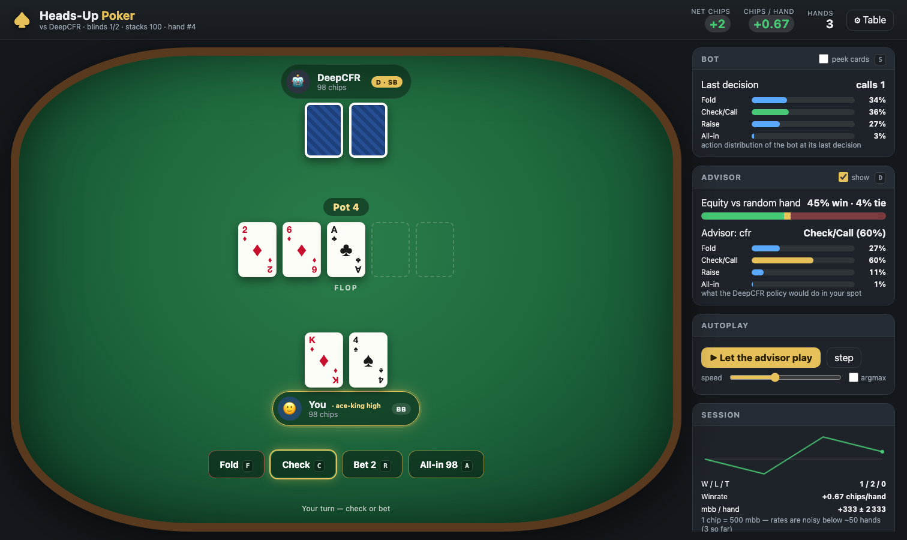

# headsup-poker

[](https://github.com/romaf5/headsup-poker/actions/workflows/tests.yml)

Heads-up no-limit-style Texas Hold'em: a fast game engine, **DeepCFR** training on Apple
Silicon (MPS) / CUDA / CPU, exploitability evaluation with a PPO best-response agent, and a
browser table to play against the bots — with a DeepCFR advisor at your side.



## Highlights

- **One engine** for everything (`headsup/engine.py`): rules, chips, showdown, cheap `clone()`
  for tree search. Blinds 1/2, stacks 100 (configurable), actions fold / check-call /
  min-raise / all-in; the 3rd raise in a row becomes an all-in so the game tree stays finite.
- **C++ kernels** (`headsup/cpp/`, pybind11): engine, treys-compatible hand evaluator, the
  DeepCFR network forward pass, external-sampling MCCFR traversals (GIL released → all cores)
  and an envpool-style vectorised env. ~50× faster traversals than Python; every kernel is
  differential-tested against its Python twin.
- **DeepCFR trainer** (`headsup/deepcfr/`): reservoir memories on the GPU, `torch.compile`,
  checkpoint/resume, Ctrl-C-safe, TensorBoard with signals that actually mean something.
- **Single Deep CFR** (Steinberger 2019, `headsup/sdcfr.py`): the same run also keeps every
  iteration's advantage net and plays the exact linear-CFR average strategy from them — no
  strategy memory / policy net approximation. `--algo deepcfr|sdcfr|both` picks the variant;
  `both` gives an apples-to-apples comparison from one training run.
- **Comparison & exploitability tools**: `headsup.compare` (round-robin head-to-head with
  standard errors) and `headsup.exploit` (several PPO best responses in parallel, argmax and
  sampled play, hundreds of thousands of hands, max = exploitability lower bound).
- **Browser UI** (`headsup/web/`, no JS build step, dependency-free HTTP server): play vs.
  the DeepCFR bot or the exploiter, see the bot's action distribution, get advice + Monte-Carlo
  equity from the DeepCFR policy, autoplay, hand history, session sparkline.

## Setup

```bash
python3.11 -m venv .venv311 && source .venv311/bin/activate
pip install -r requirements.txt            # engine, training, evaluation, web UI
pip install -r requirements-rl.txt         # + rl_games exploitability, onnx (optional)
python setup.py build_ext --inplace        # C++ kernels (needs a C++17 compiler; optional but recommended)
python -m pytest tests -q                  # 60 tests, ~45 s
```

Device selection is automatic (`mps` → `cuda` → `cpu`); override with `--device` or
`HEADSUP_DEVICE=cpu`. Torch ≥ 2.4 (the C++ build was tested with Apple clang; setup.py picks
it automatically on macOS). On CUDA the network fits are captured into CUDA graphs
(`torch.compile(mode="reduce-overhead")`: the 64-wide MLP is launch-bound, ~1.7× faster).

## Play in the browser

```bash
python -m headsup.web                                # http://127.0.0.1:8000/  vs the DeepCFR policy
python -m headsup.web --opponent pluribus            # Pluribus-style bot: tabular blueprint + real-time search (seconds per decision)
python -m headsup.web --opponent tab                 # the tabular blueprint alone
python -m headsup.web --opponent search:cfr@it20000  # DeepCFR policy + depth-limited search
python -m headsup.web --opponent call --advisor ''   # calling station, no advisor
python -m headsup.web --opponent cfr:runs/deepcfr_full/policy.pth --port 8080
```

Keys: `F` fold, `C` check/call, `R` bet/raise, `A` all-in, `Enter` next hand, `S` peek at
the bot's cards, `D` toggle the advisor, `P` autoplay. The ⚙ Table dialog switches
opponent / advisor / stacks / blinds / raise cap / seed without restarting.

## The game & observations

Seat 0 is dealer/small blind and acts first pre-flop; seat 1 posts the big blind and acts
first on later streets. Actions: fold, check/call, one raise per configured **bet size**, all-in.
The default game has a single size — the min-raise (call + one big blind) — and the third
raise in a row becomes an all-in (finite tree). `--bet-sizes 0.5,1,2` (trainer) turns it into
a no-limit-style abstraction with half-pot / pot / 2×-pot raises (always at least a min-raise,
capped by the stack; `raise_cap` consecutive raises → all-in) where raises that merely
duplicate another action (reach the stack, coincide with a smaller size, or are the capped
raise) are hidden from the tree (`mask_redundant`, on by default for custom sizes). The action
tree (`bet_sizes`, `raise_cap`, `mask_redundant`, see `headsup/game.py`) is stored in every
model's config, so envs, the UI and the tools build the right game for a given bot. Folding only
exists when facing a bet — with nothing to call it would be a dominated check, and leaving it
in the tree let early CFR iterations put lasting weight on it (the average strategy folded
~17 % of flops for free before this rule). Reward = chips won per hand (1 chip = 500 mbb at
blinds 1/2).
Observations are `float32[80]`: hand (2 × [rank+1, suit+1, card+1], sorted), board (5 × same,
flop sorted, 0-padded), stage, position, 8 normalised bet/stack features (the original 31
features), then the DeepCFR paper's bet history: for each of the 4 betting rounds and each of
its first 6 actions `[chips put in / pot before the action, 1 = an action occurred]`, and the
number of consecutive raises on the current street (index 79, needed to derive legal actions
from an observation). Every network reads the prefix it was trained on (`features=aggregated`
→ the first 31, `history`/`both` → 79), so envs and players never need to know which variant
they are talking to.

## DeepCFR training

```bash
python -m headsup.deepcfr.train --out runs/deepcfr --checkpoint-every 10          # 300 it., paper-like
python -m headsup.deepcfr.train --iterations 100 --value-steps 2000 --out runs/quick   # ~45 min on an M2 Max
python -m headsup.deepcfr.train --resume runs/deepcfr/checkpoint.pt --iterations 300 --out runs/deepcfr
python -m headsup.deepcfr.train --policy-only runs/deepcfr/checkpoint.pt --out runs/deepcfr   # re-fit the policy net
tensorboard --logdir runs
```

Per iteration and seat: 10 000 external-sampling traversals (C++, all cores) → advantage
samples into a reservoir memory on the GPU (compact: uint8 card/stage features + float32 bet
features, 75 B per 31-feature sample) → the seat's advantage network is re-fitted from
scratch (4000 steps × 16 384). At the end (or on `Ctrl-C`):

- **DeepCFR** (`--algo deepcfr` / `both`): the average-strategy network is fitted on the
  strategy memory → `<out>/policy.pth` (player spec `cfr:<out>/policy.pth`);
- **SD-CFR** (`--algo sdcfr` / `both`): all iterates are written to `<out>/iterates.pt`
  (player spec `sdcfr:<out>/iterates.pt`, or `…@exact` for exact per-infoset averaging
  instead of per-hand trajectory sampling — same distribution, see `headsup/sdcfr.py`;
  `…@g2` quadratic iterate weights, `…@t100` the average after 100 iterations, `…@k64` a bank
  thinned to 64 representative iterates; `iterate:<out>/iterates.pt@t100` plays iteration 100's
  current strategy).

- **DREAM** (`--algo dream`, Steinberger, Lerer & Brown 2020): outcome-sampling traversals (one
  trajectory each, the traverser exploring with ε = 0.5) with a learned per-player baseline
  Q̂ᵢ(h, a) — a history-input network that sees both players' hole cards (`opp_cards` model
  variant, expected-SARSA targets, FIFO of 200 000 rows, 1000 × 512 updates per iteration) —
  giving the baseline-corrected advantage estimates of the paper's eq. 6–7 (weights t / own
  sample reach); the average strategy is SD-CFR's iterate bank, as in the paper;
- **ESCHER** (`--algo escher`, McAleer et al. 2023): value trajectories under the current
  strategies train a history value net q(h, a) (player 0's return, same FIFO / updates); regret
  trajectories let the update player sample uniformly and the opponent play σ, regrets are
  q(h, ·) − σ·q read off the value net (no importance weights), the average policy is a network
  fitted on (I, t, σ) samples (plus the iterate bank for evaluation).
  Both samplers are C++ (`run_dream`, `run_escher_values` / `run_escher_regrets`), differential-
  tested against a Python reference (`tests/test_deepcfr.py`), and work for any of the games
  (`--game fhp` reproduces the papers' FHP setting: `--traversals 50000`).

Both are evaluated against simple opponents and, with `both`, head-to-head (`eval.json`).
On an M2 Max an iteration takes ≈ 40–55 s (traversals grow as the bots stop folding), on a
64-core box with an RTX 3090 ≈ 25–30 s (the fit dominates; traversals take ~1–3 s).

Network / algorithm variants (all differential-tested torch ⇔ numpy ⇔ C++; the config is
stored in every artefact — `policy.pth`, `iterates.pt`, checkpoints — so players pick it up):

| flag | choices | meaning |
|---|---|---|
| `--features` | `aggregated` (default) / `history` / `both` | bet branch input: the 8 pot-normalised totals, or the DeepCFR paper's per-street bet history (+ stack/pot, pot), or both |
| `--net` | `current` (default) / `paper` | 3 branches (cards, stage+position embeddings, bets) → 3·dim trunk, or Brown et al. Fig. 1: cards + bets only, one card embedding per card group, position appended to the bet features |
| `--cards` | `embed` (default) / `onehot` | rank+suit+card embeddings summed per group (DeepCFR) or concatenated one-hot cards into the first card layer (SD-CFR paper) |
| `--dim` | int (64) | width of every hidden layer / embedding (64: 67 844 params current, 67 524 paper) |
| `--rm-fallback` | `uniform` (default) / `argmax` | regret matching when no advantage is positive: uniform over the allowed actions, or the highest advantage with probability 1 (DeepCFR paper, Fig. 4) |
| `--preset` | `default` / `paper` | `paper` = 10 000 traversals, batch 10 000, 40 M memories, policy net 20 000 updates × 20 480 (explicit flags win) |
| `--bet-sizes`, `--raise-cap`, `--mask-redundant` | `min` (default) / pot fractions e.g. `0.5,1,2` | the action tree (see above); stored in the model config |
| `--regret-power`, `--strategy-power` | float (1) | sample weights `t^power` in the advantage / policy fits (1 = linear CFR; DCFR-style 1.5 / 2) |

What to watch in TensorBoard:

| tag | meaning |
|---|---|
| `eval_current_strategy/*` | current CFR iterate (regret matching on the advantage nets) vs random / call / all-in, chips/hand, every 5 it. |
| `eval_avg_strategy/*` | quick fit of the DeepCFR *average* strategy — the thing CFR converges — every 25 it. |
| `eval_sdcfr/*` | the SD-CFR average strategy (no fitting needed) vs the same bots, every 25 it. |
| `advantage/seat*/final_loss` | the training loss; it is weighted by the iteration `t` (linear CFR) so it grows ~linearly by design |
| `advantage/seat*/mse_unweighted`, `target_rms` | unweighted fit error vs the scale of the sampled regrets (single-sample targets are very noisy, so the ratio stays high) |
| `samples/nodes_per_traversal` | game-tree size per traversal — grows as the bots stop folding |

Evaluate any policy against the simple bots (chips/hand, batched, native env), or compare
policies head-to-head (round-robin, alternating seats, ± standard error):

```bash
python -m headsup.deepcfr.evaluate --policy cfr --hands 200000
python -m headsup.compare cfr sdcfr:runs/deepcfr/iterates.pt tab --hands 400000 --bots
```

## Exploitability (best-response lower bound with rl_games)

`headsup/rl/env.py` registers `headsup_poker` with rl_games using our vectorised env (all
tables in one process, opponent inference batched / native in C++). `headsup.exploit` trains
several PPO best responses (different seeds, in parallel), exports them to ONNX and
evaluates each against the policy with argmax and sampled play over many hands; the largest
exploiter reward is the number to quote (a lower bound on exploitability, ± SE):

```bash
python -m headsup.exploit --policy cfr --seeds 3 --epochs 1000 --hands 400000 --out runs/exploit_cfr
python -m headsup.exploit --policy sdcfr:runs/deepcfr/iterates.pt --seeds 3
python -m headsup.exploit --policy cfr --onnx runs/x/exploit_policy/exploiter_seed100.onnx   # evaluate existing exploiters
```

The lower-level pieces are still available: `python -m headsup.rl.exploitability -t/-p` (one
exploiter, rl_games CLI semantics) and `python -m headsup.rl.onnx` (export). `--device mps` works, but the
exploiter's MLP is tiny and CPU is faster.

## Local Best Response (LBR)

`headsup.lbr` implements Lisý & Bowling's *Local Best Response*: an agent that knows the
opponent's strategy, keeps a Bayesian range over the opponent's 1326 hole-card combinations
(the strategy is queried on the opponent's observation with every possible hand substituted),
computes its equity against that range with a C++ kernel (all runouts on the turn/river,
Monte-Carlo before) and picks fold / check-call / min-raise / all-in by a one-street lookahead
(bet actions use the opponent's actual fold probability per combo, otherwise the hand is
checked down). Deterministic, no training, and much stronger than a PPO best response at
finding leaks; the result is a lower bound on exploitability like the PPO one. Hands are played
in duplicate (same deal, seats swapped) so card luck mostly cancels.

```bash
python -m headsup.lbr --policy cfr:runs/x/policy.pth --hands 50000                    # 50k duplicate pairs, ~10 min
python -m headsup.lbr --policy sdcfr:runs/x/iterates.pt --hands 20000 --model-iterates 32
python -m headsup.deepcfr.train ... --lbr-every 25 --lbr-hands 1000                   # LBR curves in TensorBoard
```

For SD-CFR banks the queried model can be thinned to `--model-iterates K` representative
iterates (equal-weight bins) — the opponent still plays the full bank, LBR just becomes a bit
weaker, so the bound stays valid; T = 300 iterates cost ~4 ms per iterate per 64-table query.
The trainer logs `lbr/current_strategy`, `lbr/sdcfr` (and, at the end, `lbr_final/*` incl. the
policy net) — LBR's chips/hand, lower is better.

## Tabular blueprint (Pluribus's MCCFR-P) — trains in minutes

`headsup/blueprint.py` + `headsup_cpp.TabularBlueprint` compute a blueprint the way Pluribus does
(Brown & Sandholm 2019, supplementary Algorithm 1): tabular regrets over the public betting
tree of the whole game × a card abstraction — 169 lossless hand classes pre-flop, `--buckets`
(200) equal-mass buckets of the expected hand strength (equity vs a uniform random hand,
Monte-Carlo runouts on the flop / turn, exact on the river) on the later rounds — trained by
external-sampling **Linear MCCFR** (unweighted regret updates, regrets and strategy counters
discounted by k/(k+1) every `--discount-every` for the first `--lcfr` fraction of the run),
**negative-regret pruning** (after `--prune-after`, on 95 % of the iterations the traverser skips
actions whose regret is below −300·stack·100 chips — Pluribus's −300 M for 10 000-chip stacks —
except on the last round or into terminals; regret floor slightly below), and the average
strategy from sampled action counters (UPDATE-STRATEGY, on every round here — Pluribus tracked
only the first round and averaged later-round snapshots to save memory). Threads share the
tables (benign races, as in Pluribus). Our NL abstraction has 8 426 public nodes / 436 k
infosets (`0.5,1,2`-pot sizes: 224 k nodes / 7.6 M infosets, 200 bb: 17 M — all tabular-sized);
~8–13 k iterations/s on 24 threads, so 20 M iterations take under an hour.

```bash
python -m headsup.blueprint --game nlhe --iterations 20000000 --threads 24 --out runs/bp/nlhe.pt
python -m headsup.compare tab:runs/bp/nlhe.pt cfr:runs/x/policy.pth --hands 200000
python -m headsup.lbr --policy tab:runs/bp/nlhe.pt --hands 30000
python -m headsup.web --opponent search:tab:runs/bp/nlhe.pt@pluribus@th16      # = Pluribus (heads-up): blueprint + search
```

Player spec `tab:path.pt[@current]`. Deviations from Pluribus's blueprint: equal-mass EHS
buckets instead of k-means over equity distributions (potential-aware, EMD), iterations instead
of minutes for the schedule, the average kept on every round, no action translation (the
abstraction is played as is). Measured: 400 k iterations (40 s) already score +4.1 / +6.4 / +2.9
chips/hand vs random / call / all-in; more training makes the blueprint stronger head-to-head
(5 M beats 400 k by +0.33 ± 0.09) while it exploits the fixed bots *less* (equilibria do not
exploit) — compare with LBR / head-to-head, not with bot scores.

## Real-time search (subgame solving)

`headsup/search.py` + `headsup_cpp.SubgameSolver` / `VectorSolver` implement search at play time
the way Libratus / Modicum / Pluribus do it: at every decision the game from the current public
state is re-solved with CFR ("unsafe subgame solving", Brown & Sandholm 2017), the root dealing
both players' hands from their ranges — the opponent's reach under the blueprint, the hero's under
the strategies it actually played (nested re-solving) — and depth-limited to the end of the
current street (Brown, Sandholm & Amos 2018): street-end leaves are rolled out with a
continuation strategy (the blueprint policy net, the last SD-CFR iterate or a thinned bank of
iterates, sampled per rollout). Pre-river subgames are solved by external-sampling MCCFR with
tabular regrets and linear averaging, dealing the hero's real hand on half of its own
traversals; the river is solved exactly by full-width vector-form CFR over all 1326 hands
(DCFR by default; LCFR / CFR+ / PCFR+ selectable). `headsup.search.exploitability` computes the
exact best response of both players in a river subgame, which is how the solvers are verified
(tests): on a checked-down river with pot 4 / stacks 98 the exploitability of the solved profile
is 2.7 chips per hand pair for uniform play, 0.27 after 800k sampled LCFR iterations (2.8 s) and
0.003 after 200 vector-form DCFR iterations (0.45 s); with sampled regrets LCFR beat DCFR / CFR+ /
PCFR+ (0.27 vs 0.73 / 0.78 / 0.76), with full-width updates DCFR / CFR+ / PCFR+ beat LCFR
(0.0033 / 0.0080 / 0.0068 vs 0.0123 at 200 iterations).

```bash
python -m headsup.compare search:runs/x/policy.pth@it20000 cfr:runs/x/policy.pth --hands 2000
python -m headsup.web --opponent search:runs/x/iterates.pt@contbank@thin8   # search on top of SD-CFR
```

Later decisions on the same street are warm-started from the previous solve's regrets (scaled
to a few thousand equivalent iterations, Brown & Sandholm 2016 style): on the checked-down river
example, re-solving after check / bet reaches 0.98 instead of 4.3 chips of exploitability at 5k
iterations. Player spec:
`search:<blueprint>[@it<N>][@rit<N>][@rv<lcfr|dcfr|cfr+|pcfr+>][@focus<f>][@cont<policy|iterate|bank>][@thin<K>][@warm<N>]`.
The public state (bet history) is rebuilt from the observation (`headsup/public.py`), so the
search player works everywhere a player does (envs, UI, LBR, PPO exploiters). A decision costs
~1–2 s pre-river at 20k iterations (tables are solved in parallel threads) and ~0.5 s on the river.

### Pluribus mode (`@pluribus`)

`search:<blueprint>@pluribus[@it<N>][@b<buckets>][@th<threads>][@avg][@pfsearch]` reproduces the
heads-up case of Pluribus's search (Brown & Sandholm 2019, supplementary material): the
blueprint plays the first betting round; from the flop on every decision re-solves the **whole
remaining game** from the **start of the current betting round** ("nested unsafe search": the
opponent may have changed strategy anywhere in the round, the hero's own actions already taken
in the round are frozen for its real hand only), plays the **final iterate's** strategy (`@avg`
for the average) and, when the round ends, updates both players' ranges by Bayes' rule with the
solve's average strategy. The solver (`headsup_cpp.VectorSolver`) is Pluribus's "vector-based
Linear CFR sampling one set of board cards per thread": all 1326 hands of both players at every
public node, one sampled board per iteration and thread (public chance sampling — hands blocked
by a newly dealt card leave the reach vectors at that street, only hands compatible with the
sampled board are updated, an unbiased estimate), lossless (per-hand) infosets in the current
round and `buckets` (500) equity buckets per later round, threads sharing the tables. On the
river it is the exact full-width solver of the depth-limited mode. Verified by exact best
responses on turn subgames (all 48 rivers enumerated) and sampled-board best responses on flop
subgames (`tests/test_vector_solver.py`, `headsup/algos/holdem_br.py`): the solved flop
subgame is ~10× less exploitable than uniform play after 300 iterations, ~2 s with 16 threads
(1 675 public nodes); turn / river solves take well under a second. Deviations from Pluribus:
our buckets are equal-width bins of the hand's equity against a uniform range (Pluribus:
k-means over equity distributions), the blueprint is a neural DeepCFR / SD-CFR strategy
rather than a tabular MCCFR one, no action translation (the abstraction is played as is), and
depth-limited search with the four biased continuation strategies is only relevant pre-flop
(heads-up Pluribus solves to the end of the game from the flop), where we play the blueprint
(`@pfsearch` uses the depth-limited solver instead). The depth-limited solver does implement
Pluribus's leaf mechanism (`@k4`): at every street-end leaf each player chooses one of four
continuation strategies for the rest of the hand — the blueprint, or the blueprint with the
fold / call / raise probabilities multiplied by 5 and renormalised — as an extra regret-matched
decision of the subgame (one sampled continuation for both, `@k1`, is the default).

**About the old "500 mbb/g".** The original `poker_env.py` (used for the exploiter) had no
raise cap while the DeepCFR training env converted the 3rd consecutive raise into an all-in,
so the exploiter partly learned to raise repeatedly into lines the bot had never seen. With
uncapped raising the shipped exploiter wins ≈ +1.05 chips/hand (≈ 520 mbb/g) against the
shipped policy, but *loses* ≈ 0.67 chips/hand in the game the bot was trained on. Both sides
now share one engine; `env_config.raise_cap` selects the game (`1000000` = uncapped).

## Results

All numbers below were measured with this code on the 64-core / 2×RTX 3090 box (2026-08-17);
1 chip = 500 mbb. Three exploiters of increasing power are reported: **PPO** (`headsup.exploit`,
best of 3 seeds × 1000 epochs — a weak lower bound), **LBR** (`headsup.lbr`, 30 000 duplicate
pairs, ± SE) and **BR** (`headsup.algos.holdem_br`: the exact best response over all 1326 hands
of the full remaining game, Monte-Carlo over 12 boards — the tightest estimate; it finds ~2.5×
what LBR finds and ~10× what PPO finds). Bot columns are chips/hand vs random / call / all-in
over 400 000 hands (a *near-equilibrium strategy exploits fixed bots less the closer it gets*).

### Heads-up NL abstraction (100 bb, fold / call / min-raise / all-in, 3rd raise → all-in)

DeepCFR / SD-CFR arms, 300 iterations × 40 000 traversals, 20 M memories each (`runs/abl_*`;
`python -m headsup.summarize runs/... --br`):

| run | features | net | rm | policy vs bots | SD-CFR vs bots | policy vs SD-CFR | LBR policy | LBR SD-CFR | PPO policy | PPO SD-CFR | BR policy |
|---|---|---|---|---|---|---|---|---|---|---|---|
| base | aggregated | current | uniform | +4.19/+7.30/+3.55 | +4.25/+7.37/+3.63 | −0.06 ± 0.05 | 1.62 ± 0.09 | 1.35 ± 0.11 | 0.44 ± 0.04 | 0.56 ± 0.04 | 3.71 (1855 mbb/g) |
| history / paper | history | paper | uniform | +4.31/+7.86/+3.27 | +4.29/+7.75/+3.18 | −0.04 ± 0.05 | **1.33 ± 0.09** | **1.28 ± 0.11** | 0.01 ± 0.03 | 0.09 ± 0.03 | **3.24 (1620 mbb/g)** |
| aggregated / paper | aggregated | paper | uniform | +4.23/+6.96/+3.55 | +4.26/+6.86/+3.36 | −0.07 ± 0.05 | 1.49 ± 0.09 | 1.31 ± 0.11 | – | – | 3.68 (1839 mbb/g) |
| history / paper / argmax | history | paper | argmax | +2.21/+3.20/+0.95 | +2.24/+3.30/+0.97 | −0.05 ± 0.03 | 1.00 ± 0.09 | 0.88 ± 0.11 | – | – | 2.96 (1478 mbb/g) |

Findings: the paper's bet-history features and network are less exploitable than the aggregated
features / current network (LBR 1.33 vs 1.62); the argmax regret-matching fallback (paper) lowers
LBR further but the strategy is far more passive against the bots; DeepCFR's policy net and the
SD-CFR average tie head-to-head in every arm (±0.05 at 1.5 M hands). Longer runs
(`long_history_paper`: 1000 it. × 100 000 traversals) and the 0.5 / 1 / 2-pot action tree
(`betsize_history_paper`) are still training / evaluating.

**Tabular Pluribus blueprint** (`runs/bp/nlhe_20m.pt` = `models/blueprint_nlhe.pt`: 20 M
Linear-MCCFR-P iterations, 200 EHS buckets, ~40 min on 24 threads): LBR **0.67 ± 0.09** chips/hand
(336 mbb/g) — half of what LBR finds against the DeepCFR nets — and head-to-head over 300 000
hands it beats the DeepCFR policy by **+0.81 ± 0.04** chips/hand (≈ 405 mbb/g) and the SD-CFR
average by +0.82 ± 0.04, while scoring less against the fixed bots (+1.8 / +2.5 / +0.9). By the
12-board BR estimate the two are equal (blueprint 3.29 chips = 1646 mbb/g, DeepCFR policy 3.24,
its SD-CFR average 3.46) — the head-to-head and LBR rank the blueprint ahead, the BR estimate is
noisy at 12 boards. The table-mode abstraction (exact per-board (mean, std) equity features,
k-means, cached per board) trains at ~60 000 iterations/s once its caches are warm (20 M in
15 min). On the **0.5 / 1 / 2-pot action tree** (52 746 public nodes, 3.4 M infosets) a
table-mode blueprint with 40 M iterations (~30 min) beats the DeepCFR bet-size run
(`betsize_history_paper`, 300 it. × 40k traversals, ~6 h on a 3090) by **+0.76 ± 0.05**
chips/hand and its SD-CFR average by +0.70 ± 0.05 (300 000 hands each); its LBR / BR estimates
are running.

**Real-time search**: LBR against the Pluribus-mode player on the tabular blueprint
(`search:tab:…@pluribus@it300`, 2 000 duplicate pairs) is **−0.78 ± 0.39** chips/hand — LBR
cannot exploit it at all (vs +0.67 for the blueprint alone, +1.33 for the DeepCFR net); Pluribus
mode on top of the DeepCFR net: **−0.00 ± 0.28**; the depth-limited solver on the DeepCFR net
(`search:cfr:…@it20000`): **−0.41 ± 0.26** — every search variant is beyond LBR's reach. A
head-to-head round robin of the search players (2 000 hands per pair, ± 0.4–0.7): search on
top of the DeepCFR net gains +0.86 ± 0.55 chips/hand against the net alone, the tabular
blueprint's edge over the net is confirmed (+0.93 ± 0.44), and every pairing among the
search players and the blueprint is within noise — near-equilibrium strategies do not beat
each other, exploitability is what separates them (`runs/bp/compare_search.json`).

### Reproductions on the papers' games

**Leduc hold'em** (`python -m headsup.summarize --small-game runs/leduc`; exploitability of the
average strategy in milli-antes/game, one seed, CPU, the papers' Leduc hyperparameters: 346 / 900 /
1000 traversals per iteration, advantage nets 3000 × 2048, 2 M memories):

| algorithm (traversals / it.) | it. 10 | it. 20 | it. 50 | it. 100 | it. 200 |
|---|---|---|---|---|---|
| DeepCFR (346) | 471 | 501 | 310 | 415 | 307 |
| SD-CFR (346) | 521 | 481 | 321 | 300 | **270** |
| DREAM (900) | 666 | 523 | 442 | 427 | 385 |
| ESCHER (1000) | 961 | 721 | 935 | 727 | 528 |

Tabular references on the same game: CFR+ 92 / 71 / 35 / 21 mA/g at 100 / 200 / 1000 / 3000
iterations, DCFR 70 / 54 / 32, PCFR+ 141 / 90 / 60 / 34, external-sampling MCCFR 91 at 50 000
iterations, outcome sampling 592 at 100 000. The deep curves sit in the range of the SD-CFR /
DREAM papers' Leduc figures at 200 iterations (they run to 1000 iterations over several seeds;
ours are single seeds — the ordering SD-CFR < DeepCFR is the papers' too, DREAM matching SD-CFR
in the paper is not reproduced at this length).

**FHP** (flop hold'em, DeepCFR / DREAM papers): the DeepCFR reproduction (paper hyperparameters:
10 000 traversals, batch 10 000, 40 M memories, 450 iterations; paper: 37 mbb/g), DREAM and
ESCHER (50 000 outcome-sampling traversals per iteration, 300 iterations) are queued on the GPU;
their exploitability curves come from `headsup.algos.holdem_br` (200 boards). Already measured:
tabular MCCFR blueprints on FHP plateau at **~380 mbb/g** whatever the number of EHS buckets
(50 … 1000), iterations (0.3 … 10 M) or averaging — the floor of a one-dimensional
equity-vs-uniform-range abstraction (the DeepCFR paper's own 40 000-cluster MCCFR baseline
plateaus at a few hundred mbb/g in its Fig. 2; only its 3.6 M-cluster abstraction reaches
DeepCFR's level).

## Layout

```
headsup/engine.py        game rules, observation encoding, legal-action masks, cheap clone()
headsup/game.py          GameConfig: bet sizes / raise cap / redundant-raise masking = the action tree
headsup/env.py           PokerVecEnv / SingleAgentEnv (Python), NativeVecEnv (C++), rl_games IVecEnv API
headsup/players.py       batched players: random/call/allin/raise, torch policy, regret-matching iterate, numpy, onnx
headsup/model.py         DeepCFR network (torch); numpy_model.py = numpy mirror for CPU workers
headsup/cpp/             C++ kernels (pybind11): engine, evaluator, MLP, MCCFR traversal, VecEnv
headsup/deepcfr/         memory.py (reservoir), traverse.py, train.py, evaluate.py
headsup/sdcfr.py         Single Deep CFR: iterate bank + average-strategy player (exact / trajectory sampling)
headsup/compare.py       head-to-head comparison CLI;  headsup/exploit.py: multi-seed PPO exploitability CLI
headsup/lbr.py           Local Best Response (range tracking, equity vs range, one-street lookahead) CLI
headsup/blueprint.py     tabular Pluribus-style MCCFR-P blueprint (C++ TabularBlueprint): trainer CLI, tab: player
headsup/search.py        real-time search player (depth-limited MCCFR / Pluribus-style full-game vector solves), exploitability check
headsup/public.py        rebuild the public state (engine replay) from an observation
headsup/games/           game interface for the generic algorithms: Kuhn, Leduc (leduc.py), hold'em presets (holdem.py: nlhe / fhp / hulh)
headsup/algos/           tabular CFR / CFR+ / DCFR / PCFR+ / LCFR / MCCFR (tabular.py), exact best response (best_response.py),
                         DeepCFR / SD-CFR / DREAM / ESCHER on small games (deep.py), hold'em exploitability estimator (holdem_br.py)
headsup/web/             browser table: server.py (http.server), session.py (game logic), static/ (HTML/CSS/JS)
headsup/rl/              rl_games registration (env.py), exploiter CLI (exploitability.py), ONNX export (onnx.py)
models/                  deepcfr_policy.pth (DeepCFR net, history / paper), blueprint_nlhe.pt (tabular blueprint), README.json
tests/                   pytest suite (rules, C++ ⇔ Python ⇔ numpy equivalence for every network variant, envs, memories, SD-CFR, web API)
```

## How close is this to the papers?

**Matches DeepCFR** (Brown et al. 2019): external-sampling traversals (all actions at the
traverser's infosets, sampled opponent/chance), advantage samples `v(a) − Σσv` weighted by
the iteration (linear CFR), advantage nets re-initialised and trained from scratch every
iteration (Adam 1e-3, grad-norm clip 1, 4000 minibatch steps), reservoir memories, the
average-strategy net fitted with `t`-weighted MSE, and the paper's card-embedding network.
**Matches SD-CFR** (Steinberger 2019): all iterates kept, exact reach-weighted linear
average at play time and the trajectory-sampling variant.

**Switchable, verified against the papers** (`--features`, `--net`, `--cards`,
`--rm-fallback`, `--preset paper`, see the table above): the bet history exactly as described
in DeepCFR §5.1 ("in each of the N_rounds rounds of betting there can be at most 6 sequential
actions … each betting position is encoded by a binary value specifying whether a bet has
occurred, and a float value specifying the bet size"; we normalise the size by the pot at
that time), the Appendix C network (three card layers, two bet layers, three trunk layers
with skip connections and last-layer normalisation; one `CardEmbedding` per card group; the
paper's stated 98 948 parameters cannot be reproduced from its own Appendix C code at any
integer width, so we keep 64), the paper's regret-matching fallback ("we choose the action
with highest counterfactual regret with probability 1", ~50 % lower exploitability than uniform
in their Fig. 4), and its hyperparameters (K = 10 000 traversals, batch 10 000, 4 000 SGD
steps, 40 M memories; SD-CFR: average-strategy net 20 000 updates × 20 480, cards as
concatenated one-hot vectors, 300 000 traversals per iteration for 5-FHP).

**Pluribus** (Brown & Sandholm 2019, heads-up case): nested unsafe search from the start of
the betting round with the hero's actions frozen for its real hand, full remaining-game solves
from the flop on with vector-form Linear CFR sampling one board per thread and iteration,
lossless current-round / bucketed later-round infosets, final-iterate play, Bayes updates
with the average strategy at round ends (`@pluribus`, see the search section); the blueprint's
Linear MCCFR with negative-regret pruning is in `headsup/algos/tabular.py`
(`MCCFR(..., prune_threshold=...)`) for the small games — the hold'em blueprint here is DeepCFR / SD-CFR.

**DREAM / ESCHER** on hold'em: exact samplers (baseline correction, expected-SARSA targets, ε-
exploration; ESCHER's uniform update-player sampling and value-net regrets) and buffer sizes /
update counts from the papers; the history input is seat 0's observation plus seat 1's hole
cards (the papers concatenate both players' infostates — the same information); on Leduc /
Kuhn the generic implementations in `headsup/algos/deep.py` are used instead (see the
reproduction tables).

**Deviations** (design choices for this game): the default bet features are 8 aggregated
numbers (a mild imperfect-recall abstraction; the paper-faithful history is one flag away);
regret matching falls back to uniform by default; SD-CFR's iterate weights are `t^γ` (γ = 1
linear, `@g2` for DCFR-style quadratic weighting); memories default to 10 M (`--preset paper`
= 40 M) and the batch to 16 384; the game itself is a small action abstraction of no-limit
hold'em (fold / call / min-raise / all-in, 3rd raise → all-in) rather than HULH/FHP;
exploitability is a PPO best-response lower bound, not exact.

## References

- N. Brown, A. Lerer, S. Gross, T. Sandholm. *Deep Counterfactual Regret Minimization.*
  ICML 2019. [arXiv:1811.00164](https://arxiv.org/abs/1811.00164)
- E. Steinberger. *Single Deep Counterfactual Regret Minimization.* 2019.
  [arXiv:1901.07621](https://arxiv.org/abs/1901.07621)
- E. Steinberger, A. Lerer, N. Brown. *DREAM: Deep Regret minimization with Advantage
  baselines and Model-free learning.* 2020. [arXiv:2006.10410](https://arxiv.org/abs/2006.10410)
  (learned baselines for the sampled-regret variance — the natural next step here)
- M. Zinkevich, M. Johanson, M. Bowling, C. Piccione. *Regret Minimization in Games with
  Incomplete Information.* NeurIPS 2007 (CFR)
- M. Lanctot, K. Waugh, M. Zinkevich, M. Bowling. *Monte Carlo Sampling for Regret
  Minimization in Extensive Games.* NeurIPS 2009 (external sampling MCCFR)
- V. Lisý, M. Bowling. *Equilibrium Approximation Quality of Current No-Limit Poker Bots.*
  AAAI-17 Workshop on Computer Poker and Imperfect Information Games, 2017.
  [arXiv:1612.07547](https://arxiv.org/abs/1612.07547) (Local Best Response)
- N. Brown, T. Sandholm. *Safe and Nested Subgame Solving for Imperfect-Information Games.*
  NeurIPS 2017. [arXiv:1705.02955](https://arxiv.org/abs/1705.02955) (subgame solving, nesting)
- N. Brown, T. Sandholm, B. Amos. *Depth-Limited Solving for Imperfect-Information Games.*
  NeurIPS 2018. [arXiv:1805.08195](https://arxiv.org/abs/1805.08195) (depth limit + continuation strategies)
- N. Brown, T. Sandholm. *Solving Imperfect-Information Games via Discounted Regret Minimization.*
  AAAI 2019. [arXiv:1809.04040](https://arxiv.org/abs/1809.04040) (DCFR, LCFR)
- G. Farina, C. Kroer, T. Sandholm. *Faster Game Solving via Predictive Blackwell Approachability:
  Connecting Regret Matching and Mirror Descent.* AAAI 2021. [arXiv:2007.14358](https://arxiv.org/abs/2007.14358) (PCFR+)
- Tools: [treys](https://github.com/ihendley/treys) (hand evaluator),
  [rl_games](https://github.com/Denys88/rl_games) (PPO), [pybind11](https://github.com/pybind/pybind11)
