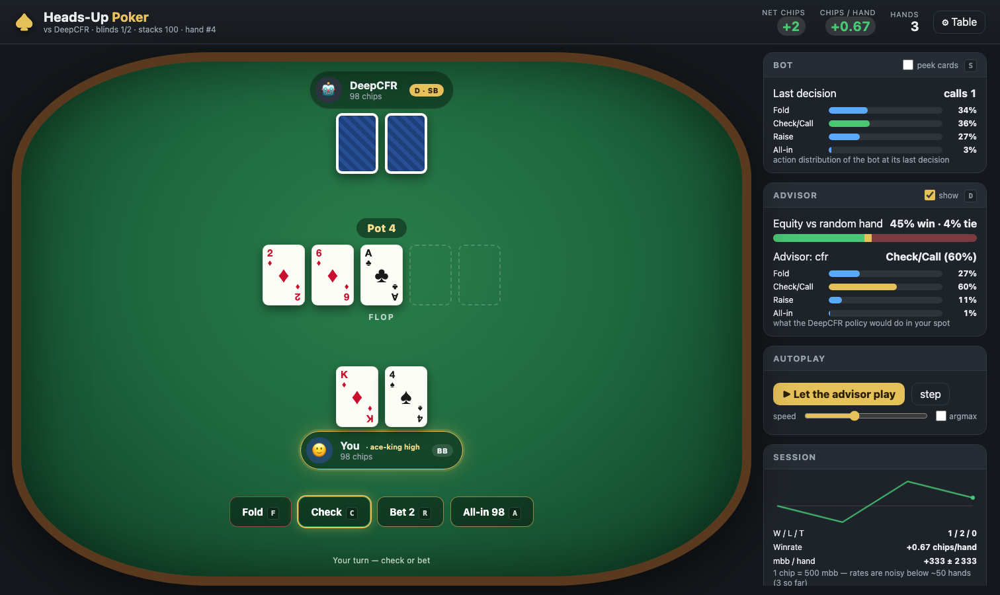

# headsup-poker

[](https://github.com/romaf5/headsup-poker/actions/workflows/tests.yml)

Heads-up Texas Hold'em research code: a fast engine (Python + C++), Deep CFR / Single Deep CFR /
DREAM / ESCHER, a Pluribus-style tabular blueprint with real-time search, best-response evaluation,
and a browser table to play against the bots.



## Quick start

```bash
python3.12 -m venv .venv && source .venv/bin/activate
pip install -r requirements.txt            # + requirements-rl.txt for the PPO exploiter
python setup.py build_ext --inplace        # C++ kernels
python -m pytest tests -q                  # ~8 min on CPU
python -m headsup.web --opponent pluribus  # play at http://127.0.0.1:8000
```

Opponents: `pluribus` (blueprint + real-time search), `tab` (blueprint), `cfr` (DeepCFR net),
`search:cfr` (net + search), `call` / `random` / `allin`. Keys: `F` `C` `R` `A`, `Enter` next hand,
`S` show the bot's cards, `D` advisor.

## Games

| game | flag | rules |
|---|---|---|
| NL abstraction | default | stacks 100, blinds 1/2, fold / call / min-raise / all-in, 3rd raise → all-in; `--bet-sizes 0.5,1,2` for pot-fraction raises |
| FHP | `--game fhp` | limit, blinds 50/100, bets 100, four bets per round (3 raises pre-flop; a bet and 3 raises on the flop), two rounds, showdown after the flop (DeepCFR paper) |
| HULH | `--game hulh` | limit, bets 100 / 100 / 200 / 200, four bets per round, four rounds |
| Leduc, Kuhn | `headsup.games` | small games with exact exploitability |

## Algorithms

| method | module | run |
|---|---|---|
| Deep CFR, SD-CFR, DREAM, ESCHER (hold'em) | `headsup/deepcfr/`, `sdcfr.py` | `python -m headsup.deepcfr.train --algo both --features history --net paper --out runs/x` |
| same on Leduc / Kuhn | `headsup/algos/deep.py` | `python -m headsup.algos.deep --game leduc --algo sdcfr` |
| Deep DCFR+ / Deep PDCFR+ (Leduc / Kuhn) | `headsup/algos/pdcfr.py` | `python -m headsup.algos.pdcfr --game leduc --variant pdcfr+` |
| tabular CFR, CFR+, DCFR, PCFR+, DCFR+, PDCFR+, MCCFR | `headsup/algos/tabular.py` | reference solvers for the small games |
| Pluribus blueprint (Linear MCCFR + pruning) | `headsup/blueprint.py` | `python -m headsup.blueprint --game nlhe --iterations 20000000 --out runs/bp.pt` |
| real-time search (depth-limited, Pluribus mode) | `headsup/search.py` | player spec `search:<blueprint>[@pluribus]` |

Trainer outputs: `policy.pth` (spec `cfr:<path>`), `iterates.pt` (SD-CFR average, spec
`sdcfr:<path>`), `checkpoint.pt` (`--resume`), TensorBoard logs. `--game fhp --preset paper` uses the
paper's hyperparameters and network (`--net deepcfr`: Appendix C with the 3x wider card branch behind its
"98,948 parameters"); `python -m headsup.deepcfr.train -h` lists the network / budget options.

## Evaluation

| tool | measures |
|---|---|
| `python -m headsup.algos.holdem_br --policy <spec> --cards all` | best-response exploitability: exact over hands, boards enumerated (FHP) or sampled per street; SD-CFR averages exactly |
| `python -m headsup.lbr --policy <spec>` | Local Best Response, a lower bound |
| `python -m headsup.compare <spec> <spec> --bots` | head-to-head chips/hand ± SE |
| `python -m headsup.exploit --policy <spec>` | PPO exploiters, a weak lower bound |

**All-in EV.** When a hand goes all-in before the last card, the played-hands tools (`compare`, `lbr`, `exploit`,
`deepcfr.evaluate`) count it with its expectation over the board cards still to come instead of the one runout that
was dealt (exact on the flop and turn, 1,000 sampled runouts pre-flop): the same mean with a smaller standard error.
`--raw` turns it off. In code: `engine.allin_ev()`, `play_hands(..., allin_ev=True)`, `headsup.cards.showdown_equity`.
LBR goes one step further: it tracks the opponent's range anyway, so a showdown counts with its expectation over
that range as well (only with an exact opponent model, i.e. not with `--model-iterates`); standard deviation per
hand against the random bot: 65 chips dealt, 24 with all-in EV, 13 with the range.

**Luck-adjusted results at the browser table.** Besides the runout, a showdown has a second piece of luck: which of
the hands it plays this way the bot happened to hold. The table values every showdown against all of them, weighted
by the probability that the bot takes its actions with each (its strategy for every hand - for `pluribus` from the
round's solve), and all-in hands over the cards to come: "all-in pre-flop with 62 % equity: worth +24.0 on average …
against all the hands the bot plays this way you have 55 %: worth +10.0 on average". Both are expectations given what
the players could see, so the session's luck-adjusted win rate has the same mean as the dealt one. Its standard
deviation per hand is about half (DeepCFR's strategy against the blueprint, 600 hands: 23 chips dealt, 16 with
all-in EV, 12 luck-adjusted), i.e. the same precision with a quarter of the hands.

## Results

### Leduc: reproductions

Exploitability of the average strategy in milli-antes per game (mean over seats, the papers' unit), mean ± sd over
seeds (`python -m headsup.algos.leduc_report`):

| SD-CFR paper setup, by iteration | 500 | 1000 | 2000 | 3000 | 5000 |
|---|---|---|---|---|---|
| **SD-CFR, Steinberger (2019) Fig. 1a** | **96** | **89** | **69** | **67** | **59** |
| SD-CFR, authors' net (3 seeds) | 90 ± 16 | 81 ± 7 | 58 ± 4 | 58 ± 7 | 60 ± 5 |
| SD-CFR, plain MLP + `--masked-loss` (2) | 78 ± 4 | 74 ± 7 | 68 ± 4 | – | – |
| SD-CFR, plain MLP (3) | 76 ± 11 | 78 ± 9 | 105 ± 20 | 80 ± 8 | 80 ± 17 |
| **Deep CFR, Steinberger (2019) Fig. 1a** | **116** | **110** | **93** | **86** | **80** |
| Deep CFR, authors' net (1) | 109 | 110 | 94 | 90 | 101 |
| Deep CFR, plain MLP (3) | 135 ± 28 | 154 ± 14 | 148 ± 17 | 158 ± 6 | 143 ± 10 |

| DREAM paper setup, by nodes touched | 2.6e6 | 3.5e6 | 6.7e6 | 1e7 | 1.3e7 |
|---|---|---|---|---|---|
| **ES-SD-CFR, Steinberger et al. (2020) Fig. 2** | **67** | **57** | **49** | **46** | – |
| ES-SD-CFR, DREAM-code settings (3) | 69 ± 1 | 61 ± 3 | 51 ± 5 | 48 ± 3 | 44 ± 5 |
| ES-SD-CFR, plain MLP (3) | 87 ± 16 | 69 ± 6 | 60 ± 3 | 57 ± 2 | 51 ± 3 |
| **DREAM, Steinberger et al. (2020) Fig. 2** | **78** | **67** | **62** | **57** | **56** |
| DREAM, DREAM-code settings (3) | 90 ± 10 | 74 ± 3 | 71 ± 2 | 60 ± 6 | 56 ± 5 |
| DREAM, plain MLP (3) | 110 ± 15 | 96 ± 9 | 79 ± 8 | – | – |

```bash
# SD-CFR paper setup (Deep CFR: --algo deepcfr --strat-capacity 1000000 --policy-steps 5000)
python -m headsup.algos.deep --game leduc --algo sdcfr --iterations 5000 --traversals 1500 --adv-steps 750 --adv-batch 2048 \
  --warm-start --adv-capacity 1000000 --arch pokerrl --loss-weights normalized --grad-clip 10 --mean-regret --device cuda
# DREAM paper setup (ES-SD-CFR: --algo sdcfr --traversals 346 without the DREAM-only flags)
python -m headsup.algos.deep --game leduc --algo dream --iterations 1500 --traversals 900 --epsilon 0.5 --q-steps 1000 \
  --q-batch 512 --shared-baseline --bootstrap-chance --adv-steps 3000 --adv-batch 2048 --arch deepcfr_dueling \
  --loss-weights normalized --grad-clip 1 --device cuda
```

What it took, beyond the papers' text (all taken from the authors' code):
- **No fitting of illegal actions' outputs.** The SD-CFR / DREAM / ESCHER networks multiply them by the legal mask; a
  plain MLP fitted to zeros there stalls at ~80 mA/g (`--masked-loss` alone fixes it; dueling head and normalisation
  do not matter).
- **The DREAM code's settings differ from the SD-CFR code's:** gradient clipping 1 (not 10), ES regrets not divided by
  the number of legal actions, one baseline net for both players trained once per iteration, with expected-SARSA
  targets bootstrapped after deals.
- **The DREAM plot's x-axis** counts decision and terminal nodes only (ours / 1.23 for ES, / 1.64 for DREAM's
  sampler); the paper values are its 3-seed means (single-seed tails excluded).

**Deep (Predictive) Discounted CFR** (Xu et al. 2025): persistent cumulative-advantage networks that are bootstrapped
from their own discounted, clipped output, outcome sampling with a learned baseline, and an average-policy network.
Paper setup, 10 000 episodes per player and iteration, 3 seeds; the last column is the mean over 9-10 M episodes:

| Leduc, by episodes | 1e6 | 2e6 | 4e6 | 8e6 | 9-10 M |
|---|---|---|---|---|---|
| **VR-DeepDCFR+, Xu et al. (2025)** | **152** | **121** | **114** | **85** | **89** |
| VR-DeepDCFR+ (3) | 101 ± 11 | 79 ± 8 | 69 ± 6 | 68 ± 5 | 69 ± 1 |
| **VR-DeepPDCFR+, Xu et al. (2025)** | **158** | **121** | **115** | **88** | **90** |
| VR-DeepPDCFR+ (3) | 102 ± 6 | 82 ± 5 | 84 ± 6 | 77 ± 6 | 77 ± 5 |

| Kuhn, by episodes | 1e6 | 2e6 | 4e6 | 8e6 | 9-10 M |
|---|---|---|---|---|---|
| **VR-DeepDCFR+, Xu et al. (2025)** | **8.7** | **7.0** | **5.2** | **5.6** | **5.3** |
| VR-DeepDCFR+ (3) | 9.3 ± 2.5 | 7.7 ± 2.3 | 6.3 ± 1.5 | 5.6 ± 0.3 | 5.4 ± 1.0 |
| **VR-DeepPDCFR+, Xu et al. (2025)** | **4.1** | **4.3** | **4.1** | **4.3** | **3.3** |
| VR-DeepPDCFR+ (3) | 4.2 ± 0.6 | 4.7 ± 1.0 | 3.4 ± 0.5 | 2.9 ± 0.3 | 3.0 ± 0.2 |

```bash
python -m headsup.algos.pdcfr --game leduc --variant pdcfr+ --episodes 10000000 --device cuda   # ~35 min on an RTX 3090
```

Both Leduc results lie inside the paper's 95 % bands (51-133 and 63-147 at 10 M episodes) and below its curves
throughout; Kuhn matches. Where the paper and the authors' code differ, the defaults follow the code (discount
constant 1.5 for DCFR+, 1 000 baseline steps, the prediction network is never re-initialised, first-legal-action
fallback); `--discount-offset`, `--q-steps`, `--reinit-prediction` and `--fallback` give the paper's values.

ESCHER's paper has no deep Leduc results. Its Leduc experiment is tabular with oracle history
values (`python -m headsup.algos.oracle`, 500 trajectories per iteration, 1000 iterations):

| NashConv at 1000 iterations | OS-MCCFR | DREAM | ESCHER |
|---|---|---|---|
| **McAleer et al. (2023), Fig. 3** | **≈0.44** | **≈0.37** | **≈0.54** |
| ours, `--average own_is` (3 seeds) | – | 0.51 / 0.48 / 0.48 | 0.87 / 0.28 / 0.51 |
| ours, exact average (default) | 0.44 | 0.15 | 0.10 |

The paper's curves are limited by how the average strategy is accumulated, not by the regret estimator:
OpenSpiel's outcome sampling adds own reach × σ / sampling reach at the update player's sampled infosets
(`--average own_is`), which is unbiased but as noisy as the importance weights; with the exact average ESCHER
is 5× better than its own figure. The regret-estimator variance, pooled over an iteration's estimates as the paper
defines it, is 5.1 for ESCHER and 312 for DREAM (paper: 5.3 and 280).
Tabular references: CFR+ 0.24, DCFR 0.15 mA/g at 1000 iterations.

### NL abstraction (chips/hand, 1 chip = 500 mbb; ± standard errors)

| strategy | LBR | head-to-head |
|---|---|---|
| DeepCFR, paper features + net, 300 it. (`models/deepcfr_policy.pth`) | 1.33 ± 0.09 | ties its SD-CFR average (−0.04 ± 0.05) |
| tabular blueprint, 20 M it., 40 min (`models/blueprint_nlhe.pt`) | **0.60 ± 0.09** | **+0.87 ± 0.04** vs the DeepCFR net |
| Pluribus-mode search on the blueprint | −0.78 ± 0.39 | within noise of the blueprint |

FHP (DeepCFR paper: 37 mbb/g total exploitability at ~3e8 nodes touched). The paper's game has four bets per round;
until 2026-10-08 our flop stopped at a bet and two raises (Appendix A's "three raises" read literally). Only the
four-bet flop reproduces the abstraction sizes in the paper's Fig. 2 (169 x 21 + buckets x 182 = 39,949 / 367,549 /
3,643,549 infoset-actions, 234,199,693 lossless), and on it our exact tabular Linear CFR (`python -m
headsup.algos.fhp_cfr`) follows the paper's dashed reference line:

| iteration | 20 | 30 | 50 |
|---|---|---|---|
| paper, Linear CFR (digitised) | 118 | 65 | 31 |
| ours, four-bet flop | 115 | 65 | 32 |
| ours, earlier three-bet flop | 116 | 60 | 28 |

(total exploitability, mbb/g). The Deep CFR numbers measured on the earlier game (80 mbb/g total after 450
iterations) are not comparable with the paper and are being re-run with the paper's network and loss weights.
Best-response exploitability of the NL strategies is being re-measured (the earlier estimates missed the board
chance factor).

Every known difference between this code and the papers (fixed, chosen, or still open) is listed in
[docs/paper-fidelity.md](docs/paper-fidelity.md).

## Layout

```
headsup/engine.py game.py cards.py     rules, action trees, observation encoding
headsup/env.py players.py              vectorised envs, batched players, player specs
headsup/model.py numpy_model.py        networks (torch, numpy mirror)
headsup/cpp/headsup_cpp.cpp            C++ kernels: engine, evaluator, MLP, traversals, solvers, blueprint
headsup/deepcfr/ sdcfr.py              hold'em trainer, reservoir memories, SD-CFR player
headsup/blueprint.py search.py         tabular blueprint, real-time search
headsup/games/ algos/                  small games, tabular + deep algorithms, best responses
headsup/lbr.py compare.py exploit.py   evaluation tools
headsup/web/                           browser table
models/                                shipped models + README.json (training details)
```

## References

Brown et al., [Deep CFR](https://arxiv.org/abs/1811.00164) (ICML 2019) ·
Steinberger, [Single Deep CFR](https://arxiv.org/abs/1901.07621) (2019) ·
Steinberger, Lerer & Brown, [DREAM](https://arxiv.org/abs/2006.10410) (2020) ·
McAleer et al., [ESCHER](https://arxiv.org/abs/2206.04122) (ICLR 2023) ·
Brown & Sandholm, Pluribus (Science 2019), [nested subgame solving](https://arxiv.org/abs/1705.02955) (NeurIPS 2017),
[DCFR](https://arxiv.org/abs/1809.04040) (AAAI 2019) ·
Brown, Sandholm & Amos, [depth-limited solving](https://arxiv.org/abs/1805.08195) (NeurIPS 2018) ·
Lisý & Bowling, [LBR](https://arxiv.org/abs/1612.07547) (2017) ·
Farina, Kroer & Sandholm, [PCFR+](https://arxiv.org/abs/2007.14358) (AAAI 2021) ·
Xu et al., [DCFR+ / PDCFR+](https://arxiv.org/abs/2404.13891) (IJCAI 2024) and
[Deep (Predictive) Discounted CFR](https://arxiv.org/abs/2511.08174) (2025)
